# 🇵🇭 RESCOM ALERT — SOLDIER MOBILE APP INSTALLATION GUIDE
### 10th Regional Community Defense Group (10RCDG), Reserve Command, Philippine Army
**Document Version:** 1.0.4 | **Classification:** Official Troop Mobilization Manual

---

## 📌 Important Notice for Troops (Basahin Bago I-install)
Ang **RESCOM ALERT** ay isang official offline emergency mobilization app ng 10RCDG Philippine Army. 
Dahil ito ay ipinapamahagi nang direkta (sideload APK) at **hindi** galing sa Google Play Store, at may kakayahang magbasa ng emergency broadcast SMS kahit walang internet, haharangin ito ng **Google Play Protect**.

Kung ang inyong cellphone ay **walang** lumalabas na *"Install anyway"* o *"Install without scanning"*, sundin ang kumpletong **Step-by-Step Guide** sa ibaba upang matagumpay na ma-install at ma-configure ang emergency siren ng inyong telepono.

---

## 📑 TABLE OF CONTENTS
1. [PHASE 1: Pag-bypass sa Play Protect at Pag-install ng APK (Steps 1–7)](#phase-1-pag-bypass-sa-play-protect-at-pag-install-ng-apk)
2. [PHASE 2: Pag-setup ng Siren Permissions sa Loob ng App (Steps 8–14)](#phase-2-pag-setup-ng-siren-permissions-sa-loob-ng-app)
3. [Paano Masusubukan kung Gumagana ang Siren](#paano-masusubukan-kung-gumagana-ang-siren)
4. [Troubleshooting & Frequently Asked Questions (FAQ)](#troubleshooting--faq)

---

## 🛡️ PHASE 1: Pag-bypass sa Play Protect at Pag-install ng APK

Kapag na-download na ang `rescom-alert.apk`, sundin ang mga sumusunod na hakbang:

### Step 1: Buksan ang Downloaded File
* Pumunta sa inyong **Downloads** folder o sa browser downloads notification.
* Pindutin ang file na **`rescom-alert.apk`**.
* Sa *"Open with"* pop-up, piliin ang **Package installer** at pindutin ang **"Just once"** (o "Always").

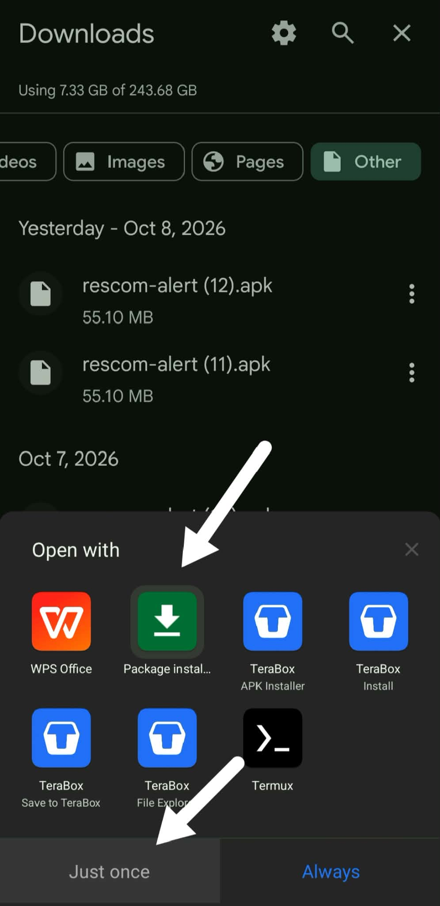

---

### Step 2: Kumpirmahin ang Installation
* Lalabas ang prompt: *"RESCOM ALERT — Do you want to install this app?"*
* Pindutin ang **"Install"**.

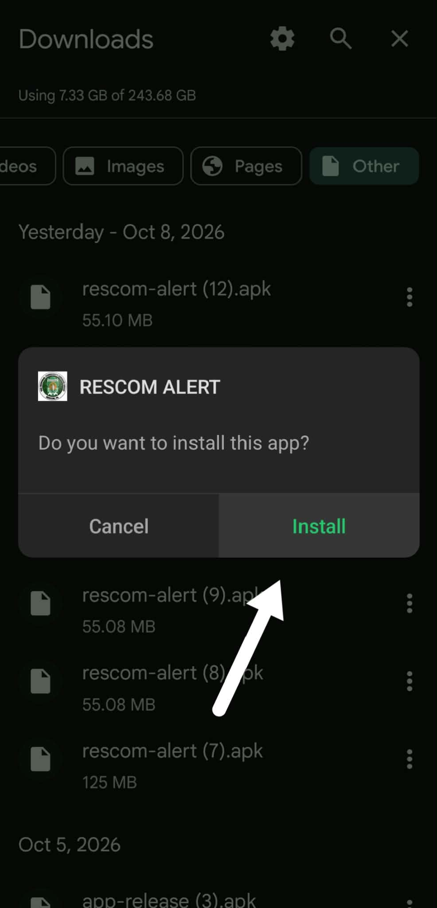

---

### Step 3: Google Play Protect Block Warning
* Dahil may direct SMS capabilities ang military app, haharangin ito ng Google gamit ang babala:  
  > *"Google Play Protect — App blocked to protect your device"*
* Kung walang *"Install anyway"* na button, pindutin ang **"Got it"**.

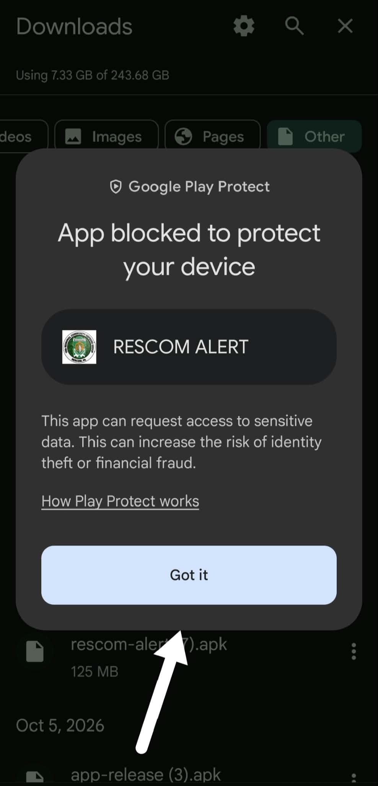

---

### Step 4: Buksan ang Google Play Store
* Pumunta sa inyong home screen o app drawer at buksan ang **Google Play Store** app.
* Pindutin ang inyong **Profile Picture / Icon** sa kanang itaas (top-right corner).

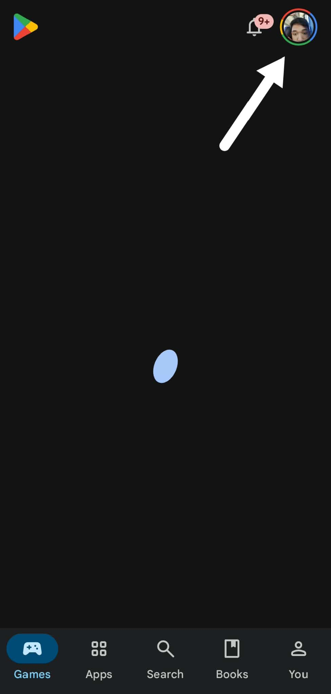

---

### Step 5: Piliin ang Play Protect
* Sa Google Account menu, hanapin at pindutin ang **"Play Protect"** (may icon na kalasag/shield).

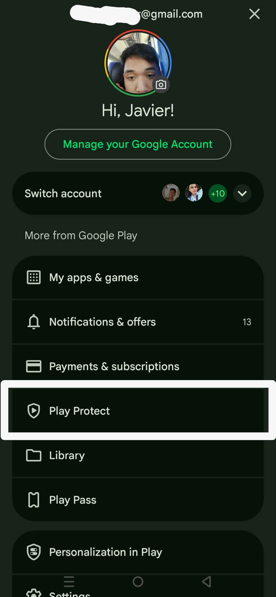

---

### Step 6: Buksan ang Play Protect Settings
* Sa Play Protect screen, pindutin ang **Gear icon (⚙️ / Settings)** sa kanang itaas (top-right corner).

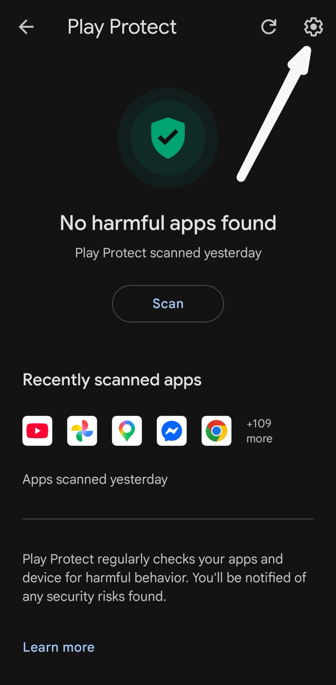

---

### Step 7: I-turn OFF ang Play Protect App Scanning
* Sa ilalim ng *General*, i-toggle o patayin ang:  
  **"Scan apps with Play Protect"**
* May lalabas na kumpirmasyon mula sa Android, pindutin ang **"Turn off"**.

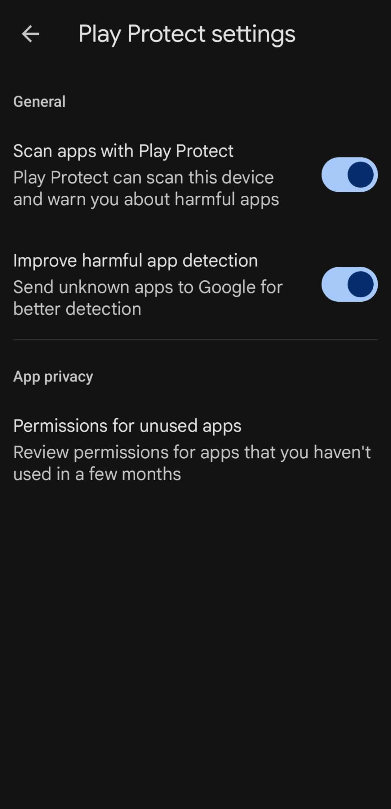

> 💡 **MAHALAGANG HAKBANG MATAPOS ITO:**  
> 1. Bumalik sa inyong **Downloads** folder.  
> 2. Pindutin muli ang **`rescom-alert.apk`** at pindutin ang **"Install"**.  
> 3. Mag-iinstall na ito nang maayos at walang harang!  
> *(Paalala: Maaari ninyong ibalik sa ON ang Play Protect matapos ma-install ang app kung inyong naisin).*

---

## 🚨 PHASE 2: Pag-setup ng Siren Permissions sa Loob ng App

Matapos ma-install, buksan ang **RESCOM ALERT** app. Kusa itong bubukas sa **Phone Setup** tab.  
**Kailangang maging KULAY BERDE (ON) ang lahat ng items** upang tumunog ang military siren kahit naka-silent ang phone o tulog ang sundalo.

---

### Step 8: Payagan ang Pagbasa ng Text Messages (SMS)
* Sa ilalim ng **"Read text messages"**, pindutin ang berdeng button na **"ALLOW"**.
* Sa lalabas na Android permission dialog, pindutin ang **"Allow"**.  
*(Ito ay para mabasa ng app ang mga emergency recall at alert SMS mula sa 10RCDG Headquarters nang walang internet).*

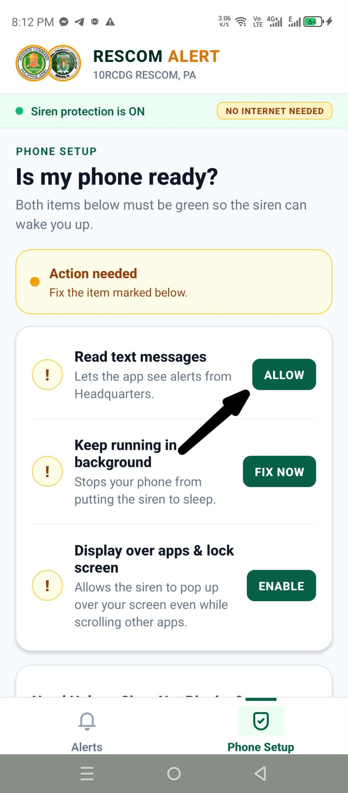

---

### Step 9: Ayusin ang Background Battery Execution
* Mapapansing berde na ang unang step (`ON`).
* Sa ilalim ng **"Keep running in background"**, pindutin ang berdeng button na **"FIX NOW"**.

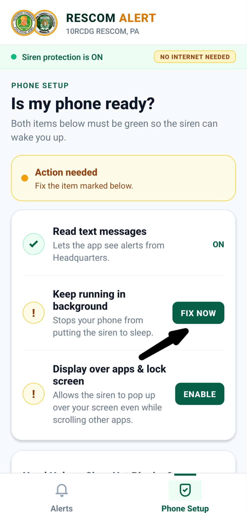

---

### Step 10: Payagan ang Background Running sa Battery Prompt
* Lalabas ang system dialog:  
  > *"Let app always run in background? Allowing RESCOM ALERT to always run in the background may reduce battery life."*
* Pindutin ang **"Allow"**.  
*(Ito ay para hindi patayin ng Android battery saver ang siren habang naka-lock ang phone).*

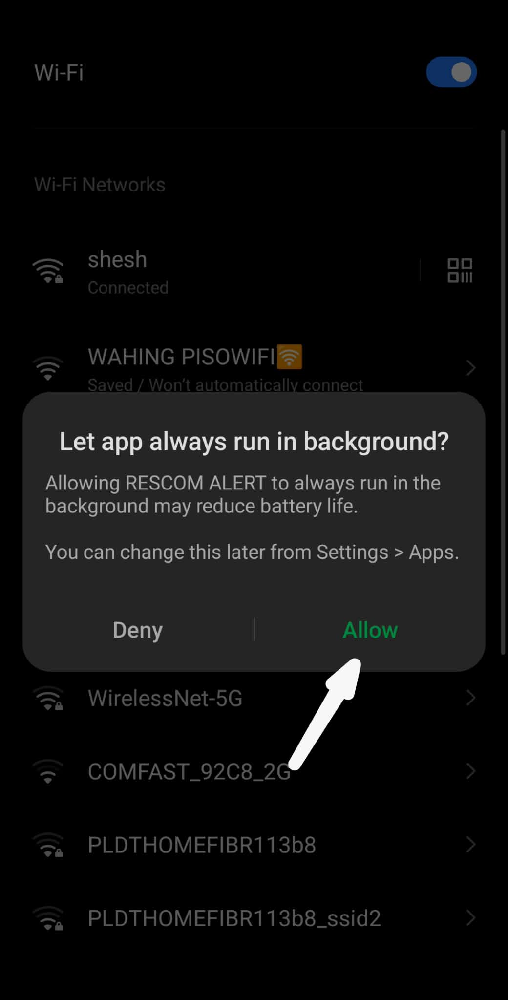

---

### Step 11: I-enable ang Display Over Apps & Lock Screen
* Mapapansing berde na ang pangalawang step (`ON`).
* Sa ilalim ng **"Display over apps & lock screen"**, pindutin ang berdeng button na **"ENABLE"**.

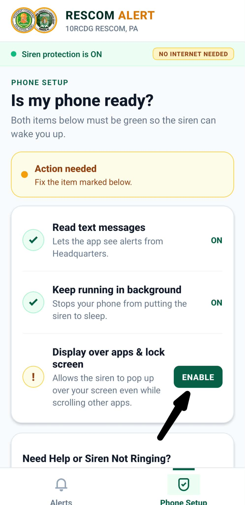

---

### Step 12: I-on ang Display Over Other Apps sa Phone Settings
* Dadalhin kayo ng Android sa system settings list ng *"Display Over Other Apps"*.
* Hanapin sa listahan ang **RESCOM ALERT**.
* Pindutin ang toggle switch upang maging **ON (asul/berde)**.
* Pindutin ang **Back button** ng inyong cellphone upang bumalik sa RESCOM ALERT app.

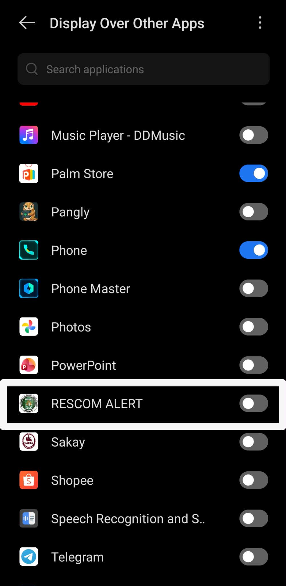

---

### Step 13: I-enable ang Full Screen Lock Screen Notifications
* Pagkabalik sa RESCOM ALERT app, may kailangan pang isang security setting.
* Pindutin muli ang berdeng button na **"ENABLE"** sa tapat ng *"Display over apps & lock screen"*.

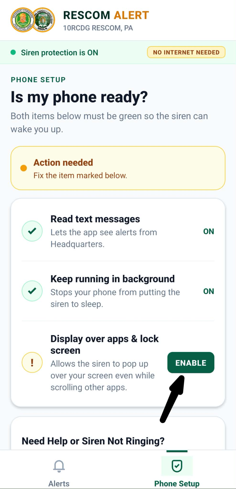

---

### Step 14: I-on ang Full Screen Notifications Toggle
* Dadalhin kayo ng Android sa *"Show full screen notifications"* screen.
* I-toggle o i-on ang:  
  **"Allow app to show full screen notifications when the device is locked"**
* Pindutin ang **Back button** ng inyong cellphone upang bumalik sa RESCOM ALERT app.

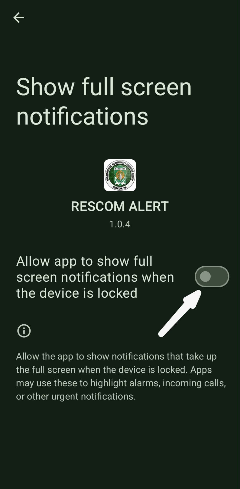

---

## ✅ MATAGUMPAY NA CONFIGURATION (All Systems Ready)

Kapag natapos ang Step 14, makikita sa pinakataas ng RESCOM ALERT app ang dalawang badge:
* 🟢 **Siren protection is ON**
* 🏷️ **NO INTERNET NEEDED**

Nakahanda na ang inyong telepono! Kapag nagpadala ang Commander o Headquarters ng emergency alert broadcast, tutunog ang malakas na military siren kahit naka-lock, naka-silent, o walang mobile data ang inyong telepono.

---

## ❓ Troubleshooting & FAQ

### Q1: Ligtas ba ang pag-patay sa Play Protect habang nag-iinstall?
**Opo.** Ang RESCOM ALERT ay binuo para sa opisyal na operasyon ng 10RCDG Reserve Command. Gumagamit ito ng direktang GSM SMS interception para makapag-patunog ng alarma kahit walang internet o cellular data. Dahil sa sensitibong SMS capability na ito, awtomatikong nagpapakita ng babala ang Google kapag ang app ay hindi nanggaling sa Google Play Store.

### Q2: Maaari ko bang ibalik ang Play Protect matapos i-install?
**Opo.** Matapos ma-install ang RESCOM ALERT, buksan muli ang Play Store → Profile → Play Protect → Settings (⚙️) at i-on muli ang *"Scan apps with Play Protect"*. Mananatiling gagana ang RESCOM ALERT.

### Q3: Paano kung naka-gray out o sinasabing "Restricted setting" ang SMS sa Android 13, 14, o 15?
Kung may prompt na *"Restricted setting"*:
1. Pumunta sa Phone **Settings** → **Apps** → **RESCOM ALERT**.
2. Pindutin ang **tatlong tuldok (⋮)** sa kanang itaas.
3. Pindutin ang **"Allow restricted settings"** at i-authenticate gamit ang fingerprint o PIN.
4. Pumasok sa **Permissions** → **SMS** → Piliin ang **"Allow"**.

---
*Headquarters 10th Regional Community Defense Group (10RCDG), Reserve Command, Philippine Army.*
