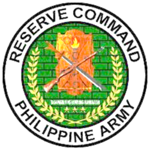
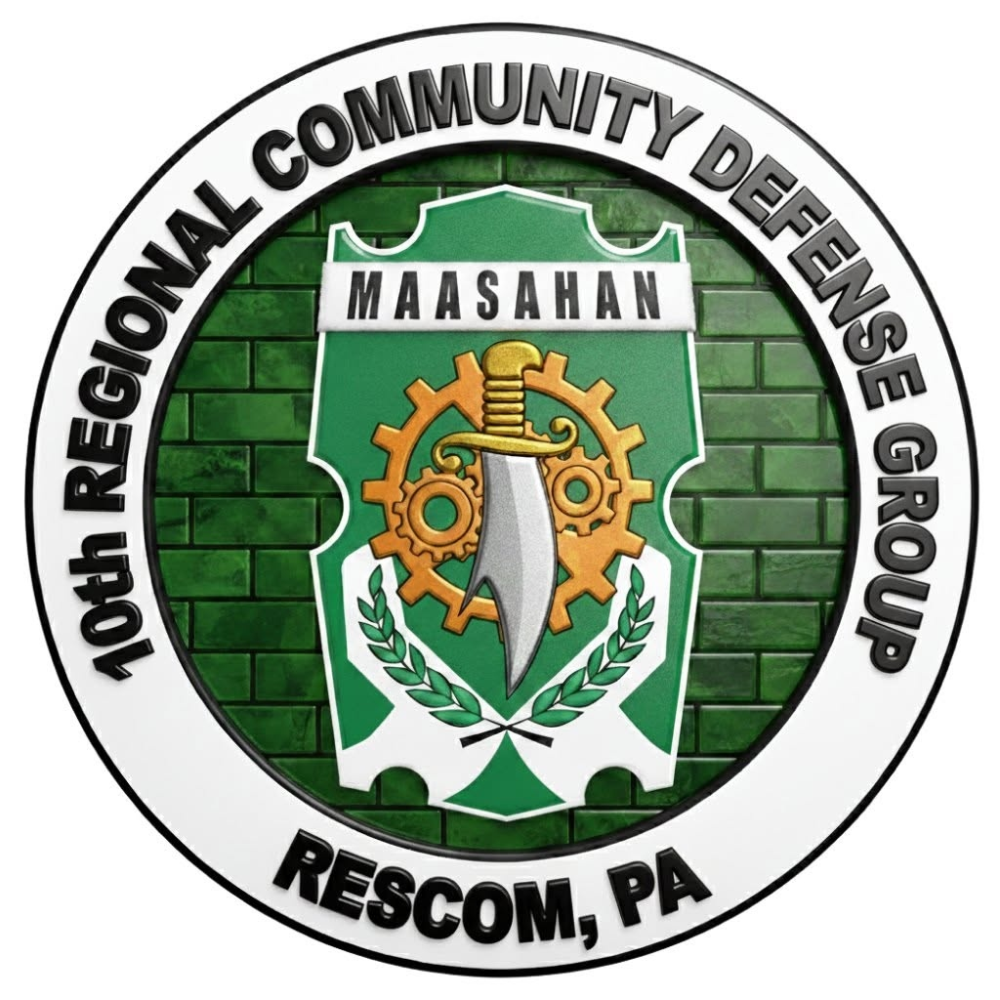
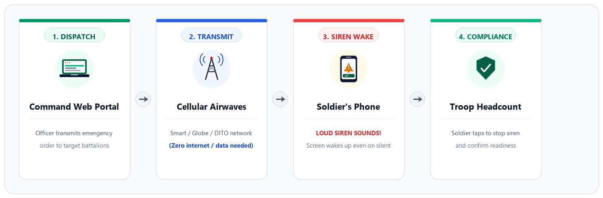

  
  &nbsp;&nbsp;&nbsp;&nbsp;
  

  # RESCOM ALERT
  ### Emergency Mass Siren & Rapid Mobilization System

  **10th Regional Community Defense Group (10RCDG)**  
  *Reserve Command, Philippine Army*

  

    
    &nbsp;
    
    &nbsp;
    
  

---

## 📌 Overview

**RESCOM ALERT** is an official emergency communication system built for the **10th Regional Community Defense Group (10RCDG)**.

It enables commanders and operations officers to issue urgent mobilization orders and disaster advisories that trigger an emergency siren on personnel devices and wake locked screens, even when phones are muted, locked, or without internet access.

### Monorepo Structure
- **Web Command Portal** (`src/`): Web dashboard for headquarters to dispatch broadcasts and manage troop rosters.
- **Android Field App** (`mobile/`): Native Android companion application with offline emergency siren engine for soldiers.

  

---

## ⚠️ Operational Problem

During natural disasters and sudden alert status escalations, conventional communication methods fail to achieve immediate troop muster:

| Operational Condition | Commercial Apps (Messenger, Viber) | Standard SMS | RESCOM ALERT |
| :--- | :--- | :--- | :--- |
| **Phone on Silent or Mute** | Ineffective (Device remains muted) | Ineffective (Standard chime is easily missed) | Emergency siren sounds at full volume |
| **Phone Screen Locked** | Screen remains dark | Displays standard notification | Screen automatically turns on with order |
| **Data Outage / Calamity** | Inoperable (Requires mobile internet) | Operable (Cellular airwaves only) | Fully Operable (Zero internet or data needed) |
| **Headcount Verification** | No verified acknowledgment | No delivery tracking | Single-tap acknowledgment logs compliance |

---

## 🔄 How It Works

### Step 1: Dispatch
An authorized officer accesses the command portal, selects the target unit (such as a Community Defense Center or battalion), enters the mobilization order, and transmits the broadcast.

### Step 2: Device Activation
Targeted devices receive the transmission over cellular airwaves. The system bypasses silent, mute, and Do Not Disturb settings, turns on the device display, and sounds an emergency siren.

### Step 3: Acknowledgment
Personnel review the order on screen and tap **"I RECEIVED THIS ORDER"**. The siren silences immediately, and compliance is logged for headquarters tracking.

---

## 🛡️ Key Capabilities

- **Bypass Silent and Mute Settings**: Ensures critical call-ups are heard regardless of device sound profiles.
- **Zero Internet Requirement**: Operates through standard cellular signals without requiring mobile data or Wi-Fi.
- **Display Activation**: Illuminates locked displays to present official orders immediately.
- **Accountability Tracking**: Provides command staff with real-time acknowledgment tallies.
- **Verified Broadcast Protection**: Filters incoming broadcasts to prevent unauthorized or spam transmissions from triggering alarms.
- **Rapid Mobilization Enlistment**: Enables rapid contact registration through secure, time-limited campaign codes during muster assemblies.
- **Field Device Distribution**: Provides direct mobile application installation through an official onboarding portal.

---

## 👥 System Users

- **Command Staff**: Dispatches emergency mobilizations and monitors regional troop response tallies.
- **Community Defense Centers (CDCs)**: Maintains personnel rosters and coordinates localized unit mobilizations.
- **Reservists and Field Personnel**: Receives prioritized emergency alerts and confirms readiness status.

---

## ❓ Frequently Asked Questions

#### Do personnel require mobile data or internet to receive alerts?
No. Alerts transmit across standard cellular airwaves. Basic cellular coverage is sufficient to receive broadcasts.

#### Will the siren sound if a device is set to silent or Do Not Disturb?
Yes. The system is designed for emergency situations and overrides device volume mutes to ensure audibility.

#### How is the siren silenced upon receipt?
Personnel tap the acknowledgment button on their screen, which immediately silences the siren and records their confirmation.

#### Can third-party or spam text messages trigger the siren?
No. The application validates official 10RCDG identifiers before activating emergency routines.

---

  Official Emergency Mass Notification System 
  <strong>10th Regional Community Defense Group (10RCDG), Reserve Command, Philippine Army</strong>

