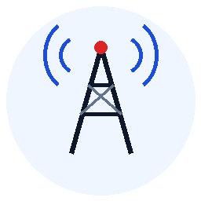
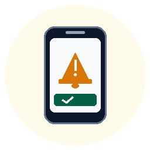

  
  &nbsp;&nbsp;&nbsp;&nbsp;
  

  # RESCOM ALERT
  ### Emergency Mass Siren & Rapid Mobilization System

  **10th Regional Community Defense Group (10RCDG)**  
  *Reserve Command, Philippine Army*

---

## 📌 What is RESCOM ALERT?

**RESCOM ALERT** is an official emergency communication system built for the **10th Regional Community Defense Group (10RCDG)**.

It allows military commanders and operations officers to send urgent call-ups and disaster warnings that **sound a loud emergency siren on soldiers' mobile phones and turn on their screens—even if their phones are locked, muted, or have no internet.**

| 🖥️ 1. DISPATCH | ➔ | 📡 2. TRANSMIT | ➔ | 🚨 3. SIREN WAKE | ➔ | ✅ 4. COMPLIANCE |
| :---: | :---: | :---: | :---: | :---: | :---: | :---: |
|  **Command Web Portal** Officer transmits emergency order to target battalions | ➔ |  **Cellular Airwaves** Smart / Globe / DITO text **(Zero internet / load needed)** | ➔ |  **Soldier's Phone** **LOUD SIREN SOUNDS** Screen wakes up even on silent | ➔ |  **Troop Headcount** Soldier taps button to stop siren & confirm readiness |

---

## ❓ The Problem: Why Regular Texts & Chat Apps Fail

During typhoons, earthquakes, and sudden Red Alert call-ups, conventional messaging apps fail to mobilize troops quickly:

| Situation in the Field | Messenger / Viber / WhatsApp | Normal SMS Text | 🛡️ RESCOM ALERT |
| :--- | :--- | :--- | :--- |
| **Phone is on Silent or Mute** | ❌ Stays silent (soldier sleeps through it) | ❌ Quiet buzz or ding | ✅ **Loud emergency siren plays at full volume** |
| **Phone is Locked** | ❌ Screen stays black | ❌ Small notification banner | ✅ **Screen automatically lights up with the order** |
| **Cell Towers Lose Internet / Data** | ❌ **Completely dead** (cannot send or receive) | ✅ Still arrives (basic cellular text) | ✅ **100% Reliable** (works without internet or mobile data) |
| **Headcount & Compliance** | ❌ Cannot track who is awake or en route | ❌ No way to verify receipt | ✅ **Soldier taps one button to stop the siren & confirm** |

---

## 🚀 How It Works (In 3 Simple Steps)

### Step 1: Officer Dispatches the Alert
An authorized officer at Headquarters logs into the command website, chooses the target unit (for example, the *1001st CDC* or an entire battalion), types the mobilization order, and clicks **Transmit**.

### Step 2: Soldier's Phone Wakes Up & Sounds the Siren
Within seconds, the soldier's phone receives the order. Even if the soldier is asleep with their phone on **Silent**, **Mute**, or **Do Not Disturb**, the phone display immediately turns on and a loud emergency siren sounds.

### Step 3: Soldier Acknowledges & Silences the Alarm
The soldier sees the official order on their screen and taps **"✓ I RECEIVED THIS ORDER"**. The siren silences immediately, and Headquarters can see that the soldier has acknowledged the call-up.

---

## ⭐ Main Features for the Unit

- 🚨 **Guaranteed Wake-Up (Bypasses Silent Mode)**  
  Eliminates missed alerts caused by muted phones during nighttime emergencies.
- 📶 **Zero Internet or Mobile Data Required**  
  Soldiers do not need mobile data, Wi-Fi, or internet load to receive alerts. It works over standard cellular signal.
- 📱 **Automatic Screen Wake-Up**  
  Turns on locked screens immediately, showing the official 10RCDG emblem and mobilization order.
- ✅ **One-Tap Troop Acknowledgment**  
  Gives commanders a clear headcount of who received the order and who is responding.
- 🔒 **Official & Protected Against Fake Texts**  
  The mobile app only sounds the siren for verified broadcasts sent by authorized 10RCDG officers. Random text messages or spam will never trigger the siren.
- 📋 **Quick Mobilization Enlistment**  
  During assemblies and training, officers can share a simple registration link with a passcode so troops can join the contact roster in seconds.
- 📥 **Quick 1-Minute App Setup**  
  Troops can scan a QR code at headquarters or open a direct link on their phone to install the app with guided setup.

---

## 👥 Who Uses This System?

- **Commanding Officers & Staff**: To broadcast urgent mobilization orders, weather advisories, and disaster relief call-ups across the region.
- **Community Defense Centers (CDCs)**: To organize, update, and manage soldier contact rosters by unit and battalion.
- **Soldiers & Reservists**: To receive guaranteed, life-saving alerts and report their readiness immediately.

---

## 💬 Frequently Asked Questions (FAQ)

#### Do soldiers need mobile data, load, or Wi-Fi to receive sirens?
**No.** The alert travels over regular cellular text message airwaves. As long as the phone has basic cellular signal bars, the siren will sound.

#### What if a soldier's phone is set to Silent or Do Not Disturb?
The app is specifically designed for emergencies to override silent and vibrate settings, sounding the alarm at full volume.

#### How does a soldier turn off the siren when it starts ringing?
The soldier simply taps the green **"✓ I RECEIVED THIS ORDER"** button on their screen. The siren stops instantly.

#### Can random spam or scam messages trigger the emergency siren?
**No.** The app strictly inspects incoming messages for official 10RCDG security credentials. Unofficial text messages are treated as ordinary texts and will never set off the alarm.

---

  Official Emergency Mass Notification System 
  <strong>10th Regional Community Defense Group (10RCDG), Reserve Command, Philippine Army</strong>

